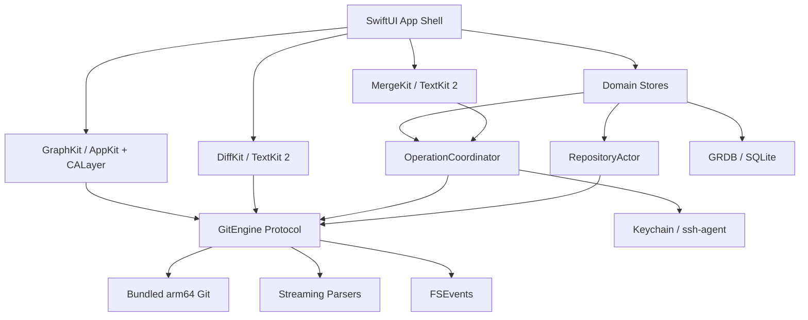
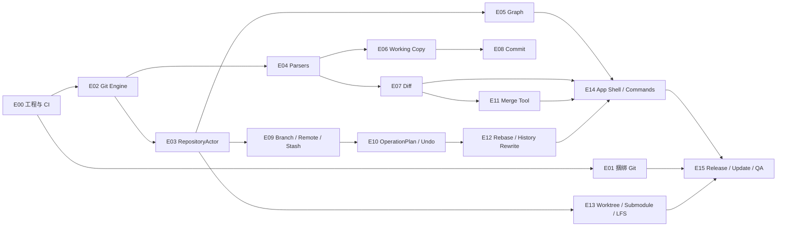

# Current v1 开发计划

版本：1.0  
制定日期：2026-07-24  
产品基线：PRD 1.0、136 项功能清单、P01–P12 交互原型  
目标平台：macOS 14+，仅 Apple Silicon  
计划周期：30 个工程周；建议另留 2 周日历缓冲  
建议启动基线：2026-08-03  
目标发布窗口：2027-03 中旬（受团队到岗与节假日影响）

## 1. 执行结论

Current v1 不是 GitKraken 的等量复刻。首发只交付高速、原生、本地优先的 Git 工作流：

- 覆盖功能清单中 47 项 MVP 和 43 项 v1.0，共 90 项。
- 不接入 GitHub/GitLab 等 Provider API，不做 PR、Issue、CI、AI、Agent 或云协作。
- 应用捆绑 arm64 Git，用户无需预装 Git。
- SwiftUI 负责应用外壳与常规界面；Graph、Diff、Merge Tool 允许使用 AppKit、Core Animation、TextKit 2。
- Git CLI 是写操作的语义真源；所有写操作由统一的 `OperationCoordinator` 编排并写后复核。
- 高频 L0/L1 操作不增加确认步骤；L2/L3 操作建立恢复锚点并显示紧凑确认。
- v1 必须包含三方 Merge Tool、Interactive Rebase、Worktree、撤销上一次可恢复操作和自动更新。
- 买断与订单处理由外部渠道完成；客户端 v1 不建设账户、付费墙或激活服务。

## 2. 计划假设

### 2.1 团队

| 角色 | 配置 | 主要责任 |
|---|---:|---|
| macOS 工程师 A | 1.0 | App Shell、SwiftUI、Commands、设置、发布 |
| macOS/性能工程师 B | 1.0 | Graph、Diff、Merge Tool、AppKit 性能面 |
| Git 内核工程师 C | 1.0 | Git Engine、解析器、操作状态机、恢复、Remote |
| 产品设计 | 0.5 | 原型细化、交互规格、可用性测试 |
| QA/自动化 | 0.5 | Fixture、集成测试、性能门禁、发布验收 |
| 产品负责人 | 0.3 | 范围、决策 Gate、试用反馈、发布判断 |

3 名核心工程师在 30 周内提供 90 engineer-weeks。Epic 估算合计约 77 engineer-weeks，剩余约 13 engineer-weeks 用于缺陷、集成与不可预见 Git 边界状态。

如果只有 1 名全职工程师：

- 不改变 v1 功能定义时，预计需要 60–66 个工程周。
- 不应通过移除 Merge Tool、捆绑 Git或性能门禁来压缩周期。

### 2.2 工程现状

制定计划时仓库中没有 Swift/Xcode 工程。Week 1 必须完成工程骨架、测试目标和 CI；所有估算从零代码基础开始。

### 2.3 已采用的默认产品答案

以下事项不阻塞制定计划，先采用默认方案；产品可在指定 Gate 前修改：

| 事项 | 默认方案 | 最晚冻结 |
|---|---|---|
| Hard Reset 确认 | 采用原型的单个紧凑确认框，不要求输入分支名；显示影响、目标 OID、恢复方式 | W10 |
| L3 远端操作 | Force Push/删除远端分支使用二次确认，并默认 `--force-with-lease` | W10 |
| Undo 白名单 | 首发支持 branch move/delete、reset、commit/amend、merge/rebase、stash drop 等具备确定恢复策略的最后一次操作 | W12 |
| 未提交改动保护 | L2 操作前建立隐藏恢复引用；涉及 worktree 内容时创建临时 stash/对象快照，成功后按保留策略清理 | W8 |
| 二进制/图片冲突 | v1 只显示冲突与外部工具入口，不在内置 Merge Tool 内编辑 | W12 |
| 自定义 Git | 放在 Settings > Advanced；默认始终使用捆绑 Git | W4 |
| 崩溃与诊断 | 不接入第三方崩溃上传；系统崩溃报告和脱敏诊断包仅由用户手动导出 | 已冻结 |
| 商业授权 | 客户端不做激活；外部商店或人工发放 | 发布前 |

### 2.4 已冻结的工程选型

2026-07-24 已确认：

| 决策 | 方案 | 执行约束 |
|---|---|---|
| D01 Git 引擎 | v1 只用捆绑 Git CLI | 保留 `GitEngine` protocol；没有性能门禁失败证据时不引入 libgit2 |
| D02 子进程 | `swift-subprocess` | W2 大输出、取消和进程组实验失败时，协议后回退 Foundation/`posix_spawn` |
| D03 状态架构 | Observation + actor + feature store | 不全局采用 TCA；复杂 Git 操作使用领域状态机 |
| D04 Diff/Merge | 自有 TextKit 2 适配层 | W4 与 STTextView 对照，但第三方组件不默认进入核心链路 |
| D05 语法高亮 | Tree-sitter，首发 12 种语言 | 可视区异步高亮；超大文件降级；grammar 单独做许可证审核 |
| D06 崩溃数据 | 系统报告 + 用户手动导出诊断包 | v1 不集成 Sentry，不自动上传 |
| D07 开发 CI | 本机编译/测试/性能；GitHub Actions 做最低版本兼容性 | 当前不做打包、签名、公证；进入发布工程后恢复这些 Gate |

D07 只描述当前阶段。Developer ID、Hardened Runtime、notarization、Sparkle EdDSA、安装、升级和回滚仍是 v1 发布要求，不因延后而删除。

## 3. 范围基线

### 3.1 首发范围

| 版本层 | 能力数 | 定义 |
|---|---:|---|
| MVP | 47 | 本地 Git 高频闭环、通用 Remote、基础安全与发布基线 |
| v1.0 | 43 | 专业历史改写、Merge Tool、Worktree、高级 Git、自动更新 |
| 合计 | 90 | 首发必须通过范围与质量 Gate 的能力 |

### 3.2 明确不进入 v1

- GitHub、GitLab、Bitbucket、Azure DevOps 登录与 API。
- PR/MR、Issue、CI、Launchpad、Cloud Patch、团队功能。
- Agent Session、AI Commit、AI Explain、AI Merge。
- Intel/Universal Binary、Windows、Linux。
- 内置完整终端或 IDE。
- 客户端账户、订阅、激活、席位管理。
- Gitflow、提前冲突预测、内置图片/二进制 Merge。

发现这些需求时，进入 `Post-v1` 列表，不得借“顺手实现”进入当前里程碑。

## 4. 工程架构

### 4.1 建议仓库结构

```text
Current/
├── Current.xcworkspace
├── Apps/
│   └── CurrentMac/
│       ├── App
│       ├── Scenes
│       ├── Commands
│       ├── Resources
│       └── Settings
├── Packages/
│   ├── CurrentDomain
│   ├── GitEngine
│   ├── GitParsers
│   ├── RepositoryModel
│   ├── GraphKit
│   ├── DiffKit
│   ├── MergeKit
│   ├── OperationKit
│   ├── CredentialKit
│   └── CurrentUI
├── Vendor/
│   └── Git-arm64/
├── Tests/
│   ├── Fixtures
│   ├── Integration
│   ├── UI
│   ├── Performance
│   └── Security
├── Tools/
│   ├── FixtureGenerator
│   ├── BenchmarkRunner
│   ├── BundleGit
│   └── GenerateSBOM
└── docs/
```

### 4.2 模块边界



关键约束：

- UI 不直接创建或持有 `Process`。
- 所有 Git 参数使用数组传递，禁止 shell 字符串拼接。
- 每个 common Git dir 只有一个 `RepositoryActor` 和 mutation queue。
- 写操作完成后必须用 Git 可机读输出复核。
- 读取结果必须绑定 repository generation，过时结果不得覆盖新状态。
- 不在数据库复制 Git object database 或保存仓库全文。

### 4.3 首批 ADR

在 W2 前建立以下 Architecture Decision Records：

1. ADR-001：SwiftUI-first 与 AppKit 性能面边界。
2. ADR-002：Git CLI 作为写操作语义真源。
3. ADR-003：Bundled Git 构建、签名、版本与 GPL 合规。
4. ADR-004：RepositoryActor 与 common Git dir 并发模型。
5. ADR-005：Graph 分页、lane allocation 与视图虚拟化。
6. ADR-006：Diff 流式解析与 TextKit 2 渲染。
7. ADR-007：OperationPlan 风险等级与恢复策略。
8. ADR-008：FSEvents、generation invalidation 与主动刷新。
9. ADR-009：Keychain、credential helper 与 ssh-agent。
10. ADR-010：直接分发、Sparkle 2、签名与公证。

## 5. 依赖关系与关键路径



关键路径：

1. 工程骨架 → 捆绑 Git → Git Engine → RepositoryActor。
2. 解析器 → Working Copy/Diff → Commit/Merge Tool。
3. OperationPlan → Recovery → Rebase/Reset/Undo。
4. Graph/Diff/Merge 性能原型 → 产品全量开发。
5. 签名、公证、Sparkle、SBOM → 可分发 v1。

## 6. 里程碑

### M0：技术可行性，W1–W4

目标：证明架构能达到性能和兼容性底线。

交付：

- Xcode workspace、Swift Package 模块、CI、代码签名占位配置。
- 捆绑 arm64 Git 的可重复构建与应用内调用。
- Git process runner：流式 stdout/stderr、取消、超时、脱敏。
- porcelain v2、for-each-ref、log、cat-file batch 解析器。
- S/M/L fixture generator。
- Graph 50k/500k commit 性能原型。
- 10k/100k 行 Diff 性能原型。
- RepositoryActor、FSEvents、generation 原型。

退出 Gate：

- M/L Graph 和 Diff 达到 PRD SLO 的至少 80%。
- 捆绑 Git 在无系统 Git 的 macOS 14/15 Apple Silicon 测试机运行。
- 进程取消不遗留子进程或错误 UI 状态。
- 解析器通过恶意/异常文件名 fixture。
- 未通过则不进入完整 Alpha。

### M1：内部 Alpha，W5–W12

目标：团队可以只使用 Current 完成本地高频工作。

交付：

- P01 欢迎/仓库启动器。
- P02 Working Copy、文件/hunk stage、commit/amend。
- P03 增量 Graph、WIP、refs、搜索、Inspector。
- P04 Inline/Hunk Diff、比较。
- P05 branch、remote、fetch/pull/push、stash。
- P09 Operation Console、取消、日志脱敏。
- P11 Command Palette、核心快捷键。
- 基础 merge/cherry-pick/revert/reset 与冲突状态机。

退出 Gate：

- 团队连续 2 周不依赖其他 GUI 完成 P0 高频操作。
- 47 项 MVP 中至少 43 项完成；剩余只能是已批准的发布/诊断尾项。
- 30 个 mutation fixtures 初版全部写后复核一致。
- S/M 基准无超过 10% 的性能回退。

### M2：公开 Beta，W13–W20

目标：完成危险操作、冲突与产品级稳定性。

交付：

- P07 三方 Merge Tool。
- P12 OperationPlan、恢复锚点、撤销上一次可恢复操作。
- Split Diff、行级 stage、语法高亮。
- File History、Blame。
- 外部 Diff/Merge Tool。
- crash/diagnostic、自动更新功能；签名、公证延后到发布工程阶段。
- 多窗口恢复、主题、布局持久化。

退出 Gate：

- Merge Tool 文本冲突 fixture 通过率 100%。
- mutation 集成测试通过率 100%。
- 受控自动化/人工测试会话与用户主动提交诊断样本中的 crash-free sessions > 99.5%；报告必须标明样本范围，不代表全量生产用户。
- 5 名测试用户完成原子提交、解决冲突和 reset 恢复，无口头指导。
- Alpha 反馈中 P0/P1 数据损失缺陷清零。

### M3：v1 RC 与发布，W21–W30

目标：补齐专业功能并通过性能、合规和发布 Gate。

交付：

- P06 Interactive Rebase 与恢复/继续/中止。
- Worktree、Submodule、LFS、Hooks、Signing。
- Local Workspace、仓库管理中心、多标签与多窗口完整恢复。
- Patch、部分 stash、auto-stash、tag、squash merge、安全强推。
- 设置页、捆绑/自定义 Git、版本与许可证信息。
- Sparkle 生产通道、回滚方案、SBOM、第三方许可证。
- RC1、RC2、最终 v1。

退出 Gate：

- 90 项 v1 能力全部达到 Definition of Done。
- 所有 P01–P12 场景与原型意图一致。
- S/M/L 性能 SLO 达标或有产品签字豁免。
- 全新 Apple Silicon 测试机无系统 Git 完成打开、init、clone、commit、fetch、push、merge。
- 签名、公证、更新、回滚与许可证清单通过。
- P0/P1 缺陷为 0；P2 仅允许有明确 workaround 和后续计划。

## 7. 双周 Sprint 计划

| Sprint | 周次 | 主要目标 | 可验收增量 |
|---|---|---|---|
| S01 | W1–W2 | 工程骨架、Git Bundle、Process Runner | App 能显示捆绑 Git 版本并执行只读命令 |
| S02 | W3–W4 | Parser、Actor、Graph/Diff Spike、Fixtures | M/L 原型性能 Gate |
| S03 | W5–W6 | 打开/init/clone、最近仓库、refs/status | P01、P02 基础 |
| S04 | W7–W8 | Graph/WIP/search、文件级 stage、Inline Diff | P03、P04 基础 |
| S05 | W9–W10 | hunk stage、commit/amend、branch、stash | 本地提交闭环 |
| S06 | W11–W12 | Remote、凭据、Operation Console、Palette | M1 Alpha Gate |
| S07 | W13–W14 | merge/cherry-pick/revert/reset、冲突状态 | L2 操作状态机 |
| S08 | W15–W16 | 三方 Merge Tool、恢复锚点、Undo | P07、P12 |
| S09 | W17–W18 | Split Diff、行级 stage、History/Blame | P04、P08 完整 |
| S10 | W19–W20 | 自动更新、签名、公证、诊断、Beta 修复 | M2 Beta Gate |
| S11 | W21–W22 | Interactive Rebase、squash/reword/drop | P06 |
| S12 | W23–W24 | Worktree、Submodule、LFS | 高级仓库工作流 |
| S13 | W25–W26 | Hooks/Signing、Tag、Patch、部分 Stash | 高级 Git 完整 |
| S14 | W27–W28 | Workspace、设置、主题、恢复、性能收敛 | P05、P10 完整 |
| S15 | W29–W30 | RC、发布审计、回滚演练、v1 | Production v1 |

## 8. Epic 工作包

| Epic | 范围 | Feature IDs | 原型 | 主责 | 估算 | 目标 |
|---|---|---|---|---|---:|---|
| E00 | 工程、模块、CI、测试骨架 | 横切 | 全部 | A | 3 ew | W2 |
| E01 | 捆绑 Git、SBOM、版本检查 | APP-13/14、SEC-04 | P01/P10 | C+A | 4 ew | W4 |
| E02 | Process Runner 与 GitEngine | 横切 | P09 | C | 4 ew | W4 |
| E03 | RepositoryActor、Watcher、Cache | 横切 | P01–P05 | C | 4 ew | W6 |
| E04 | Graph 与 Commit Search | GRAPH-01/02/03/04/05/06/08/09/10/11 | P03 | B | 6 ew | W18 |
| E05 | Working Copy 与 Stage | FILE-01/02/03/04/05/06/07 | P02 | C+B | 5 ew | W18 |
| E06 | Diff、History、Blame、Patch | FILE-08/09/10/11/12/13/14/15/18/19 | P04/P08 | B | 6 ew | W20 |
| E07 | Commit 与 History Mutation | COMMIT-01/02/03/04/05/06/07/08/10/11/12/13 | P02/P03 | C | 4 ew | W26 |
| E08 | Branch、Rebase、Tag | BRANCH-01/02/03/04/05/06/08/09 | P05/P06 | C | 4 ew | W24 |
| E09 | Remote 与凭据 | REMOTE-01/02/03/04/05/06 | P05/P09 | C+A | 4 ew | W20 |
| E10 | Stash | STASH-01/02/03/04 | P05 | C | 2 ew | W26 |
| E11 | OperationPlan、Recovery、Undo | UNDO-01/02/03 | P09/P12 | C+A | 5 ew | W18 |
| E12 | Conflict 与 Merge Tool | CONFLICT-01/02/03/04 | P07 | B+C | 6 ew | W18 |
| E13 | Worktree/Submodule/LFS/Hooks/Maintenance | ADV-01/02/03/05/06 | P05/P10 | C | 6 ew | W28 |
| E14 | App Shell、仓库中心、Workspace、Commands | APP-01/02/03/04/05/06/08/09/11、COLLAB-01、TERM-01/02/04 | P01/P03/P10/P11 | A | 4 ew | W28 |
| E15 | 自动更新、设置、诊断、隐私 | APP-12、SEC-01/02/03/05 | P09/P10 | A | 3 ew | W20 |
| E16 | 性能基准与回归门禁 | 横切 | P02/P03/P04/P07 | B+QA | 3 ew | 持续 |
| E17 | 发布、签名、公证、回滚 | SEC-04、APP-12 | P10 | A+QA | 4 ew | W30 |

总估算：约 77 engineer-weeks；QA、设计和产品工作不计入核心工程容量。

详细可导入任务见 `Current-v1开发看板.csv`。

## 9. 功能到原型的开发映射

| 原型 | 开发主线 | 关键依赖 | 自动化重点 |
|---|---|---|---|
| P01 欢迎/启动器 | E01、E03、E14 | Git Bundle、Bookmark/权限 | 无系统 Git、无效仓库、100 最近仓库 |
| P02 Working Copy | E05、E07 | status parser、Diff | 特殊文件名、stage 一致性、失败保留输入 |
| P03 Commit Graph | E04 | log parser、lane、虚拟化 | merge/octopus/shallow、滚动性能 |
| P04 Diff | E06 | patch parser、TextKit 2 | 10k/100k 行、rename、binary、空白 |
| P05 Branch/Remote | E08、E09、E10、E13 | Actor、Credential | ahead/behind、认证失败、取消 |
| P06 Rebase | E08、E11 | OperationPlan、冲突状态 | continue/abort、崩溃恢复、todo 校验 |
| P07 Merge Tool | E12 | Diff3、TextKit 2、冲突状态 | ours/theirs/result、冲突标记、写后复核 |
| P08 History/Blame | E06 | path log、blame parser | rename 跟踪、大文件、commit 跳转 |
| P09 Operations | E02、E11、E15 | typed events、redaction | 取消、失败、token 脱敏、诊断导出 |
| P10 Settings | E01、E14、E15、E17 | Git validation、Sparkle | 捆绑/自定义回退、更新开关 |
| P11 Palette | E14 | Action Registry | 上下文禁用、快捷键、VoiceOver |
| P12 风险/撤销 | E11 | RecoveryStrategy | 目标 OID、失败降级、只撤销最后一次 |

## 10. 测试计划

### 10.1 测试金字塔

| 层级 | 内容 | 运行频率 |
|---|---|---|
| Unit | parser、lane allocator、patch、redaction、recovery plan | 每个 PR |
| Component | Graph/Diff/Merge 渲染与状态模型 | 每个 PR |
| Integration | 临时真实 Git 仓库执行写操作并复核 | 每个 PR |
| UI | P01–P12 关键路径、键盘与 VoiceOver | 每日/发布分支 |
| Performance | S/M 每 PR，L 每夜 | 自动门禁 |
| Security | 凭据、日志、参数注入、更新签名 | 每周/RC |
| Release | 签名、公证、安装、更新、回滚 | 每个 RC |

### 10.2 30 个高风险 fixture 最小集合

- merge：FF、no-ff、clean、text conflict、rename/delete、octopus。
- rebase：clean、conflict、continue、skip、abort、启动中断。
- reset：soft、mixed、hard、dirty worktree、detached HEAD。
- cherry-pick：single、range、conflict、abort。
- stash：tracked、untracked、partial、pop conflict、drop recovery。
- branch：delete merged/unmerged、rename、recreate、remote tracking。
- worktree：shared refs、locked、dirty remove、branch already checked out。
- remote：auth failure、non-fast-forward、force-with-lease stale、network cancel。

每个 fixture 必须验证：

1. 命令退出状态。
2. UI 操作状态。
3. HEAD、refs、index、worktree 的预期状态。
4. before/after OID。
5. 恢复策略是否存在且可执行。
6. 日志中不包含 secret。

### 10.3 文件名与输入边界

必须覆盖：

- 空格、换行、Tab、Unicode normalization、emoji。
- 前导 `-`、非常长路径、大小写冲突。
- rename/copy、symlink、submodule、file mode。
- CRLF/LF、无末尾换行、二进制文件。
- 大 commit message、非法编码输出、hook 大量 stderr。

### 10.4 Definition of Done

一项能力只有同时满足以下条件才算完成：

- 对应 Feature ID 和用户故事明确。
- 产品/设计状态与 P01–P12 或补充规格一致。
- Unit/Integration/UI 测试按风险完成。
- 写操作有 OperationPlan、风险等级与写后复核。
- 错误、取消、重试、恢复路径已实现。
- 可访问性标签、键盘操作和菜单入口完成。
- 日志经过脱敏，无 secret。
- 性能无超过 10% 回退。
- 文档、变更日志和诊断信息更新。
- 产品与 QA 验收通过。

## 11. 性能实施计划

### 11.1 基准环境

- 基线机：M1 8 GB、M1 Pro 16 GB、当前一代 Apple Silicon。
- 系统：macOS 14 最新补丁、macOS 15 最新补丁及发布时主流版本。
- S/M/L 仓库与 PRD 定义一致。
- 冷缓存、热缓存分开记录 p50/p95。

### 11.2 采集指标

- 冷启动到窗口可交互。
- 打开仓库到首批 200 条 Graph。
- status 首次结果。
- Graph frame time、掉帧与主线程 hang。
- Diff 首屏与滚动。
- 搜索首结果。
- idle CPU、稳态内存、30 分钟增长。
- fetch/索引期间交互延迟。
- 安装体积和捆绑 Git 体积。

### 11.3 门禁

- S/M 每次合并主分支自动运行。
- L 每夜运行。
- 关键指标回退 > 10% 自动阻止合并。
- 若指标达不到绝对 SLO，必须在 RC 前产品签字，不允许静默放宽。
- 每个里程碑用 Instruments 做 hangs、allocations、file activity、energy 审计。

## 12. CI/CD 与分发

### PR Pipeline

1. SwiftFormat/SwiftLint（规则冻结后）。
2. Build Debug arm64。
3. Unit tests。
4. Integration fixtures。
5. S/M 性能对比。
6. Secret/log redaction tests。
7. 生成测试报告与性能差异。

### Nightly

1. L 仓库性能。
2. 30 分钟稳定性与内存增长。
3. macOS 14/15 矩阵。
4. 捆绑 Git 自检、LFS/SSH/HTTPS smoke。
5. UI 主路径。

### Release

1. 固定 Git 与依赖版本。
2. 生成 SBOM、许可证与对应源码说明。
3. Archive Release arm64。
4. Developer ID 签名与 Hardened Runtime。
5. Notarization 与 stapling。
6. Sparkle appcast 与 EdDSA 签名。
7. 全新机器安装/升级/回滚测试。
8. 分阶段发布：内部 → 10% Beta → 50% → 100%。

## 13. 安全与数据保护

- 不读取或复制用户 SSH 私钥。
- HTTPS 凭据交给 Keychain/credential helper。
- token、URL userinfo、Authorization header、私钥片段、环境变量不得入日志。
- Operation Console 显示脱敏命令；诊断包导出前可预览。
- 外部 editor/diff/merge 启动参数必须结构化传递。
- hooks、filters、credential helper 视为不受信任子进程：支持取消、超时、输出上限。
- Sparkle 只接受签名更新；更新失败不得破坏当前版本。
- 临时恢复引用和 stash 有明确清理策略，清理前确保不再是唯一恢复路径。

## 14. 产品沟通与决策 Gate

| Gate | 时间 | 产品必须确认 | 未确认时默认 |
|---|---|---|---|
| G1 架构与范围 | W2 | 90 项范围、团队、应用代号、最低系统 | 按本计划执行 |
| G2 性能 | W4 | SLO 是否冻结、基线机型 | PRD SLO 不变 |
| G3 危险操作 | W10 | hard reset/force push 确认、恢复文案 | 原型交互 |
| G4 Merge | W12 | 二进制冲突、外部工具优先级 | 二进制延后 |
| G5 隐私 | W16 | 手动导出诊断包的字段与脱敏检查 | 不自动上传，仅用户手动导出 |
| G6 Beta | W20 | Beta 人群、数据收集、P2 接受标准 | 受邀 Beta |
| G7 商业发布 | W26 | 售价、设备数、退款、渠道 | 不进入客户端 |
| G8 Go/No-Go | W30 | 性能豁免、已知问题、发布时间 | 不满足 Gate 不发版 |

### 需要产品尽早确认但不阻塞启动

1. 正式产品名与 Bundle ID。
2. 首发语言：默认建议英文 + 简体中文。
3. Hard Reset 是否接受临时 stash/对象快照带来的少量耗时。
4. Undo 白名单最终列表和恢复点保留时长。
5. 外部 Diff/Merge Tool 首发适配名单。
6. macOS 15/16 是否加入发布测试矩阵。
7. Beta 是否需要内置反馈入口。
8. 买断渠道、价格与许可证设备数。

## 15. 项目管理规则

### 节奏

- 周一：Sprint 目标和风险复核。
- 每日：15 分钟工程同步，Git 边界问题单独记录。
- 周三：Graph/Diff/Merge 性能报告自动发布。
- 周五：可运行增量演示，产品只验收完成状态。
- 双周：Sprint Review、Retro、范围与容量调整。
- 每个里程碑：正式 Gate 评审并记录结论。

### 状态

- `Backlog`：尚未满足 Definition of Ready。
- `Ready`：范围、验收、依赖明确。
- `In Progress`：有唯一主责和当前 PR。
- `Blocked`：写明阻塞对象、需要的决定和最晚解决时间。
- `In Verification`：代码完成，正在集成/性能/产品验证。
- `Done`：满足 Definition of Done。

### 范围变化

- 新需求必须关联 Feature ID 或创建新 ID。
- 进入 v1 的新增项必须说明替换掉哪项容量。
- Provider/AI/Agent/Cloud 默认拒绝进入 v1。
- 性能、数据正确性、安全、恢复、Merge Tool、捆绑 Git不是可交换范围。

## 16. 前两周启动清单

### W1

- 创建 Xcode workspace 和 Swift Package 模块。
- 配置 macOS 14 deployment target、arm64 only。
- 建立 CI、unit/integration/performance test targets。
- 实现 `GitExecutableLocator` 和固定 Bundle 路径。
- 实现 `GitProcessRunner` 雏形：参数数组、流式输出、取消。
- 建立 S/M/L fixture generator 的接口。
- 创建 ADR-001 至 ADR-004。
- 产品确认 Bundle ID、产品代号和语言范围。

### W2

- 打包可运行的 arm64 Git。
- 实现版本/架构/核心命令自检。
- 实现初版 secret redactor。
- 定义 `GitEngine`、`GitCommand`、`GitResult`、`GitOperationEvent`。
- 定义 `RepositoryIdentity`、`RepositorySnapshot`。
- 建立 SBOM 与许可证生成任务。
- 完成首个无系统 Git 的 init/status/log smoke test。
- 评审 G1，冻结 M0 出口条件。

W2 演示：

1. 在全新 Apple Silicon 测试账户启动 Current。
2. About/Settings 显示捆绑 Git 版本。
3. 初始化仓库、创建一次提交、读取 log。
4. Operation Console 显示脱敏命令和流式输出。
5. 取消一个长运行 Git 命令且没有遗留进程。

## 17. 发布完成定义

只有以下事实全部成立，Current v1 才算完成：

- 90 项首发能力全部满足 Definition of Done。
- P01–P12 全部可从真实应用到达并完成关键交互。
- M0/M1/M2/M3 Gate 均有书面通过记录。
- 30 个高风险 fixture 的状态与 Git CLI 复核一致。
- S/M/L 性能结果满足 SLO 或有产品签字豁免。
- 无系统 Git 的 macOS 14+ Apple Silicon 机器通过端到端工作流。
- 内置 Merge Tool、Interactive Rebase、Undo/Recovery 通过可用性测试。
- P0/P1 缺陷清零。
- 签名、公证、Sparkle 更新、回滚演练通过。
- SBOM、第三方许可证、隐私说明和版本说明齐全。
- Provider、AI、Agent、付费系统没有成为客户端依赖。

## 18. 计划维护

- 产品范围变化：同时更新 PRD、功能清单、本文和开发看板。
- Sprint 调整：更新开发看板的目标周次和状态，不改写已完成历史。
- 性能 SLO 变化：必须记录变更原因、基线数据与批准人。
- 每个里程碑完成后，将实耗与估算对比，用于校准后续阶段。

权威来源：

- `../research/GitKraken竞品调研与macOS原生Git客户端PRD.md`
- `../research/gitkraken_feature_inventory.csv`
- `../sites/current-macos-prototype/public/current-macos-prototype.html`
